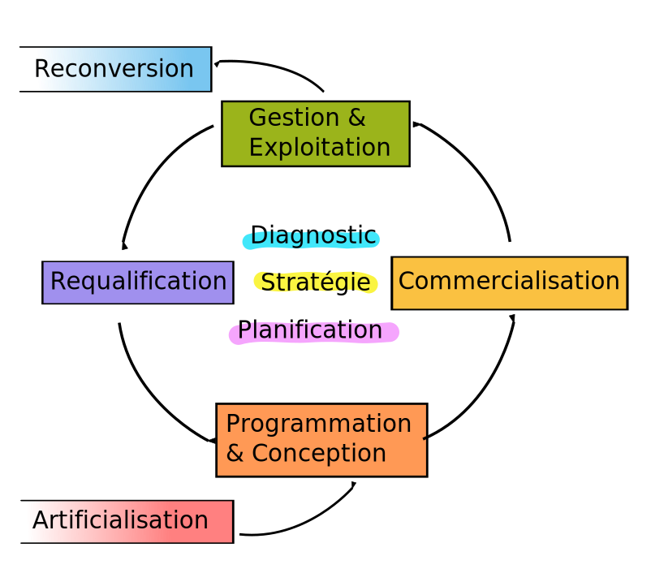

title: Outils
summary: Des outils et méthodes utilisables pour la mise en oeuvre de stratégie foncières

Des outils et méthodes utilisables pour la mise en oeuvre de stratégie foncières.Pour faciliter le parcours, ils ont pour l'heure été classés dans une logique de _cycle de vie_ des espaces d'activités[^cycle].

A l'appui de ce cycle de vie, le système comporte 3 champs d'actions transversaux relatifs à la stratégie et à l'organisation de l'activité économiques

!!! doc "[la connaissance et l'observation](./connaissance/observatoire_foncier_eco.md)"
    sont indispensables pour proposer les meilleures solutions aux entreprises et aux territoires

!!! contact "[la stratégie économique](./strategie_territoriale/)"
    fixe un cape et permet un affichage clair des ambitions du territoire vis à vis des partenaires

!!! map "[la planification](./planification/SCoT.md)"
    permet et favorise la mise en oeuvre effective du projet stratégique dans un phasage choisi

Le système comporte 2 champs d'actions transversaux qui correspondent plus spécifiquement à la dimension sociale des ZAE

!!! contact "[la gestion et l'animation](./vie_ZA/)"
    ont été identifiées comme les éléments essentiels pour une zone d'activité pérenne et attractive

!!! recycle "[l'écologie industrielle et territoriale](./EIT/installer_demarche_eit.md)"
    mérite un investissement accru au vu des perspectives qu'elle offre pour les entreprises et pour l'économie locale

Enfin, on retrouve une série d'outils et méthodes à visée plus _opérationnelle_

!!! map "[usages fonciers](./foncier/optimisation_performance_foncier_et_bati.md)"
    pour tirer le meilleur parti du foncier à disposition et des partenariats possibles

!!! label "[normes et labels](./labels/)"
    permettent d'inscrire les projets dans un cadre connu et de les valoriser

!!! euro "[finances et fiscalité](./finances/)"
    parce que _le marché_ ne peut pas tout, il est parfois nécessaire de réguler et de financer les investissements

[^cycle]: Schéma du cycle de vie des ZAE 
