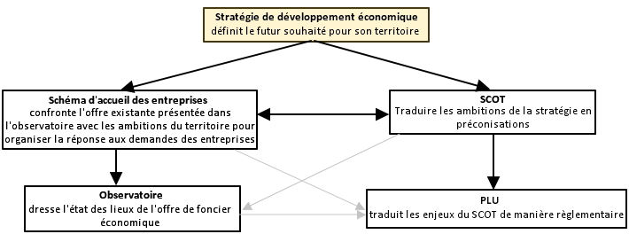

title: Stratégies territoriales de développement économique
mermaid: oui

La stratégie de développement économique est un des outils qui peut être mis au service d’un projet de territoire. Elle permet une maîtrise par les collectivités des développements locaux et une mise en cohérence avec les autres enjeux territoriaux : démographie, logements, environnement, etc.

Elle doit idéalement être alimentée par un [observatoire du foncier économique][observatoire-ZAE], qui permet une connaissance fine et à jour de l'offre territoriale et sert de base à l'ensemble des réflexions.

La stratégie permet de sortir d'une logique d'offre non différenciée, parfois excessive, et d'adapter l'offre à une demande réelle des entreprises ou aux besoins identifiés pour le territoire.

Elle peut s'appuyer pour sa mise en oeuvre sur les [documents de planification][planification], les contrats de territoire ou encore les appels à projets...

!!! info
    Les graphiques proposés ici sont une première ébauche. La réflexion est en cours pour les optimiser.

graph TB
  S("Stratégie de développement économique définit le futur souhaité pour le territoire")
  A(Schéma d'accueil des entreprises confronte l'offre existante avec les ambitions pour répondre aux besoins des entreprises)
  O(Observatoire état des lieux de l'offre foncière)
S-->A
A-.-O
O-->S
Sr-.-S
subgraph Planification
  Sr[SRADDET]-->Sc[SCoT]
  Sc-->Pl[PLUi]
end
S-->Sc  
Sc-.-A
style S fill:#dad,stroke-width:3px

## Pilotage et Mise en oeuvre
Les collectivités en charge du développement économique sont particulièrement concernées, étant elles-mêmes souvent à la manoeuvre pour l'élaboration des documents de planification.

Elles peuvent s'appuyer par le dialogue avec les organismes consulaires ([Chambres de Commerce][CCI], [Chambres des métiers][CMA], [Chambres d'Agriculture][CA]) souvent volontaires pour engager des réflexions de ce type. Ces organismes disposent d'une bonne connaissance du tissu économique et peuvent permettre un lien plus direct avec les entreprises.

## Points de vigilance
L’offre foncière du territoire n’est qu’un des outils au service du développement économique du territoire. D'ailleurs, il n'y a pas de corélation entre l'ouverture de nouvelles surfaces à l'activité et le développement des emplois et de la population.

La stratégie ne devrait donc surtout pas se limiter à des calculs de surface disponible. Elle doit bien intégrer les atouts du territoire, en terme de desserte physique et numérique, d'écosystèmes d'entreprises, de cadre de vie, de démographie des actifs, de niveaux de formation.

Une attention particulière à l'organisation des territoires voisins et un dialogue avec ces territoires pour des stratégies coordonnées sont naturellement recommandés.

[observatoire-ZAE]: ../connaissance/observatoire_foncier_eco.md
[planification]: ../planification/

