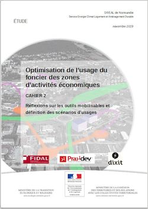

editor: PRAXIDEV, Dixit, Fidal, CEREMA, DREAL Normandie
authors: Gilles Coffin - Sylvain Grisot - Dorothée Courilleau, Frédérique Gey - Nathalie Léglise, Gaëlle Schauner - Hélène Buhot, Sylvain Comte, Florence Monroux
title: Étude pour l'optimisation du foncier d'activités
date: 2018 / 2019
tags: économie étude ZAE
url: http://normandie.developpement-durable.gouv.fr/etude-pour-l-optimisation-du-foncier-des-espaces-d-a2049.html

La Loi ALUR, notamment, appelle les collectivités locales à intégrer des réflexions de densification et de mutation d’espaces déjà artificialisés afin de limiter l’extension urbaine sur les terres agricoles et naturelles. Cette démarche d’approche de l’usage du foncier comme une ressource à préserver et à optimiser doit également entrer en cohérence avec les objectifs de réduction d’émission de gaz à effets de serre mais aussi répondre à un contexte budgétaire de plus en plus contraint des collectivités locales, tant en investissement qu’en fonctionnement.

Le principal objectif de cette étude exploratoire est de permettre à la [DREAL Normandie](../../a_propos/partenaires), ainsi qu’aux partenaires de l’aménagement et du développement économique, d’identifier [les mécanismes actuellement en œuvre qui limitent l’optimisation de l’espace](determinants.md) pour l’aménagement du foncier à vocation économique et d’envisager les leviers mobilisables pour transformer ce mode d’occupation.

Ce travail, en s'appuyant sur des [scénarios illustratifs](scenarios.md) vise à proposer une méthodologie adaptative et [des outils](../../../outils/) aux collectivités, aménageurs et entreprises. L’objectif associé est de maîtriser fermement l’ouverture des terres à l’urbanisation, tout en conservant la capacité d’offrir des possibilités d’implantation à de nouvelles activités sur leur territoire, ou d’extension/adaptation pour les entreprises en place.
