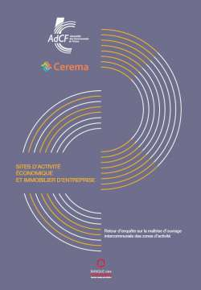

authors: AdCF, Cerema
title: Sites d'activité économique et immobilier d'entreprise
date: décembre 2018
revision: 2019-10-23
summary: Les résultats de l'enquête nationale réalisée auprès des communautés et des métropoles avec l'Adcf montrent la nécessité de repenser le rôle des sites d'activités sur les territoires. Cette évolution passe par la requalification de nombreux sites, par une gestion patrimoniale des zones dédiées aux entreprises et par une meilleure intégration urbaine de ces espaces économiques dans la ville.
tags: économie étude
url: https://www.cerema.fr/fr/actualites/sites-activite-economique-immobilier-entreprise

Dans le cadre du transfert des compétences sur les zones d'activités aux communautés et métropoles, l’AdCF et le Cerema ont lancé au cours de l’été 2017 une enquête, afin de mesurer les conditions de cette évolution pour les zones d’activité et de dégager des perspectives pour les intercommunalités.

Au total, 234 intercommunalités ont répondu à cette enquête nationale qui permet de tirer plusieurs enseignements sur leur niveau d’engagement en matière de planification, de programmation, d’aménagement et d’animation de ces sites d’activité.

Les résultats montrent la nécessité de repenser le rôle des sites d'activités sur les territoires. Cette évolution passe par la requalification de nombreux sites, par une gestion patrimoniale des zones dédiées aux entreprises et par une meilleure intégration urbaine de ces espaces économiques dans la ville.

Ils appellent aussi à d’autres travaux, afin de tenir compte des contextes territoriaux particuliers aux bassins d’emploi et de l’influence exercée par des mutations socio-économiques ou urbaines. Les enjeux de [connaissance et d’observation foncière][observatoire-ZAE] sont très importants dans ce domaine. Modèle économique et financier de la redynamisation des friches industrielles, évolution des partenariats avec les établissements publics fonciers, nouveaux modes de gestion publique/privée, relations entre intercommunalités et foncières de l’immobilier commercial…

[observatoire-ZAE]:../../../outils/connaissance/observatoire_foncier_eco
