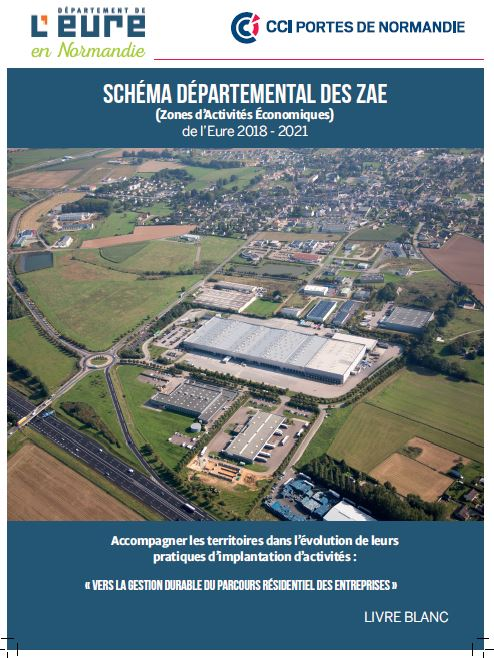

title: Livre blanc des ZAE de l'Eure
authors: département de l'Eure, CCI Portes de Normandie
date: 2018
summary: Ce document stratégique mis au point par le département de l'Eure et la CCI Normandie s'est construit en association avec les collectivités locales par le biais d'ateliers de sensibilisation et de réflexion.
url: https://eureennormandie.fr/nos-aides-et-services/elus/commerce/boite-a-outils-commerce/
image: livre_blanc_ZAE_eure-2018.jpg

 Partant du principe que l’aménagement et la gestion des Zones d’Activités Économiques (ZAE) constituent l’un des piliers de la vitalité et de l’attractivité d’un territoire, le Département de l’Eure et la CCI Portes de Normandie ont mené une réflexion sur les ZAE à l’échelle départementale pour réviser la stratégie élaborée en 2012 avec pour objectif de constituer un document ressource visant à soutenir les intercommunalités dans leurs décisions.

Le Département de l’Eure et la CCI Portes de Normandie ont souhaité associer les territoires dès le début à l’élaboration de cette nouvelle stratégie d’aménagement des ZAE en les conviant à deux ateliers collectifs de sensibilisation et de réflexion sur les enjeux liés à cette thématique et à une rencontre bilatérale.

* Disposer d’un état des lieux des ZAE dans l’Eure ;
* Donner des clés de lecture sur les enjeux actuels de l’aménagement des ZAE (montée en puissance de la prise en compte de l’environnement et de l’économie circulaire, nécessité de réduire le prélèvement d’espaces naturels ou agricoles, développement d’une offre de services qualitative aux entreprises et aux salariés …) ;
* Sensibiliser sur l’intérêt d’élaborer une stratégie de programmation et de planification des ZAE à l’échelle intercommunale voire au-delà ;
* Exposer les principes d’une gestion durable du parcours résidentiel des entreprises.
