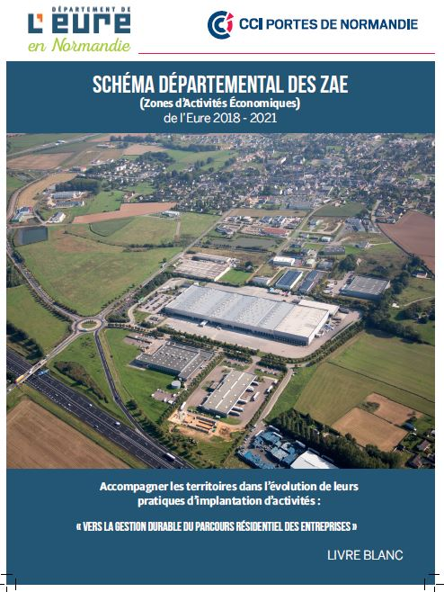

title:livre blanc des ZAE de l'Eure 

# Schéma Départemental des ZAE de l'Eure 2018-2021

## Objectifs

 L’aménagement et la gestion des Zones d’Activités Économiques (ZAE) constituent l’un des piliers de la vitalité et de l’attractivité d’un territoire. C’est pourquoi, le Département de l’Eure et la CCI Portes de Normandie ont mené une réflexion sur les ZAE à l’échelle départementale. À ce titre, une révision de la Stratégie Départementale des ZAE (SDZAE), élaborée en 2012, a été engagée au cours de l’année 2018 avec pour objectifs de constituer un document ressource visant à soutenir les intercommunalités dans leurs décisions.

Le Département de l’Eure et la CCI Portes de Normandie ont souhaité associer les territoires dès le début à l’élaboration de cette nouvelle stratégie d’aménagement des ZAE en les conviant à deux ateliers collectifs de sensibilisation et de réflexion sur les enjeux liés à cette thématique et à une rencontre bilatérale.

## Bénéficiaires

Etablissement public de coopération intercommunale (EPCI)

## Actions éligibles

## Le Département accompagnent des EPCI avec pour objectifs de :

* isposer d’un état des lieux des ZAE dans l’Eure ;

* donner des clés de lecture sur les enjeux actuels de l’aménagement des ZAE (montée en puissance de la prise en compte de l’environnement et de l’économie circulaire, nécessité de réduire le prélèvement d’espaces naturels ou agricoles, développement d’une offre de services qualitative aux entreprises et aux salariés …) ;

* sensibiliser sur l’intérêt d’élaborer une stratégie de programmation et de planification des ZAE à l’échelle intercommunale voire au-delà ;

* exposer les principes d’une gestion durable du parcours résidentiel des entreprises.

 

## conditions d’attribution
Tout EPCI sollicitant le Département

## Montant
Accompagnement pris en charge totalement ou partiellement par le Département et la CCI dans le cadre de leur convention de partenariat

## Marche à suivre
Prendre contact avec les services du Département de l’Eure.

## Contact

Direction de l’aménagement du territoire
Pôle attractivité du territoire
valerie.auffray@eure.frSchéma Départemental des ZAE (SDZAE)

 

## Objectifs
L’aménagement et la gestion des Zones d’Activités Économiques (ZAE) constituent l’un des piliers de la vitalité et de l’attractivité d’un territoire. C’est pourquoi, le Département de l’Eure et la CCI Portes de Normandie ont mené une réflexion sur les ZAE à l’échelle départementale. À ce titre, une révision de la Stratégie Départementale des ZAE (SDZAE), élaborée en 2012, a été engagée au cours de l’année 2018 avec pour objectifs de constituer un document ressource visant à soutenir les intercommunalités dans leurs décisions.

Le Département de l’Eure et la CCI Portes de Normandie ont souhaité associer les territoires dès le début à l’élaboration de cette nouvelle stratégie d’aménagement des ZAE en les conviant à deux ateliers collectifs de sensibilisation et de réflexion sur les enjeux liés à cette thématique et à une rencontre bilatérale.

## Bénéficiaires
Etablissement public de coopération intercommunale (EPCI)

## Actions éligibles
Le Département accompagnent des EPCI avec pour objectifs de :

* disposer d’un état des lieux des ZAE dans l’Eure ;

* donner des clés de lecture sur les enjeux actuels de l’aménagement des ZAE (montée en puissance de la prise en compte de l’environnement et de l’économie circulaire, nécessité de réduire le prélèvement d’espaces naturels ou agricoles, développement d’une offre de services qualitative aux entreprises et aux salariés …) ;

* sensibiliser sur l’intérêt d’élaborer une stratégie de programmation et de planification des ZAE à l’échelle intercommunale voire au-delà ;

* exposer les principes d’une gestion durable du parcours résidentiel des entreprises.

 

## Conditions d’attribution
Tout EPCI sollicitant le Département

## Montant
Accompagnement pris en charge totalement ou partiellement par le Département et la CCI dans le cadre de leur convention de partenariat

## Marche à suivre
Prendre contact avec les services du Département de l’Eure.

 

## Contact
Direction de l’aménagement du territoire
Pôle attractivité du territoire
valerie.auffray@eure.fr