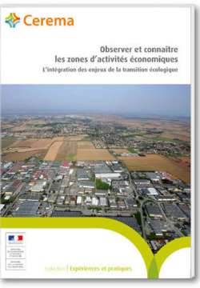

authors: Cerema
title: Observer et connaître les zones d’activités économiques
date: septembre 2017
summary: La connaissance des zones d’activités économiques (ZAE) devient cruciale pour améliorer l’aménagement des ces espaces dédiés à l’accueil des entreprises par les opérateurs et les maitres d’ouvrage. Cette publication montre qu’une intégration de ces enjeux peut aller de pair avec le développement économique territorial.
tags: économie guide
url: https://www.cerema.fr/fr/actualites/publication-observer-connaitre-zones-activites-economiques
ISBN: 978-2-37180-195-0
img: observer_connaitre_ZAE-cerema.jpg

 Les zones d’activités économiques (ZAE) sont des espaces aménagés pour accueillir les entreprises. Cependant, de nombreux acteurs publics et privés s’interrogent actuellement sur les instruments d’observation qui permettent de repérer ces espaces, de suivre leurs évolutions économiques et urbaines et d’aménager de manière durable les nouvelles zones et celles qui doivent être requalifiées.

Six dispositifs ont été étudiés et mettent en évidence des objectifs d’appui à l’élaboration de projets de planification, de promotion économique territoriale, de mobilisation collective et de quantification de l’offre foncière économique. Certaines pratiques choisissent de conforter ces objectifs et d’autres d’en développer de nouvelles en intégrant des critères qualitatifs d’évaluation des aménagements en ZAE, d’analyse des déplacements domicile – travail ou de repérage des friches industrielles.

La pluralité des dispositifs d’observation recensés par le Cerema et ses partenaires montrent que les enjeux de la transition écologique sont pris en compte inégalement par les opérateurs de ces dispositifs. Les maîtres d’ouvrage intègrent progressivement ces enjeux dans leurs attentes et les opérateurs adaptent, à leur tour, les méthodes et les sources d’observation nécessaires.
